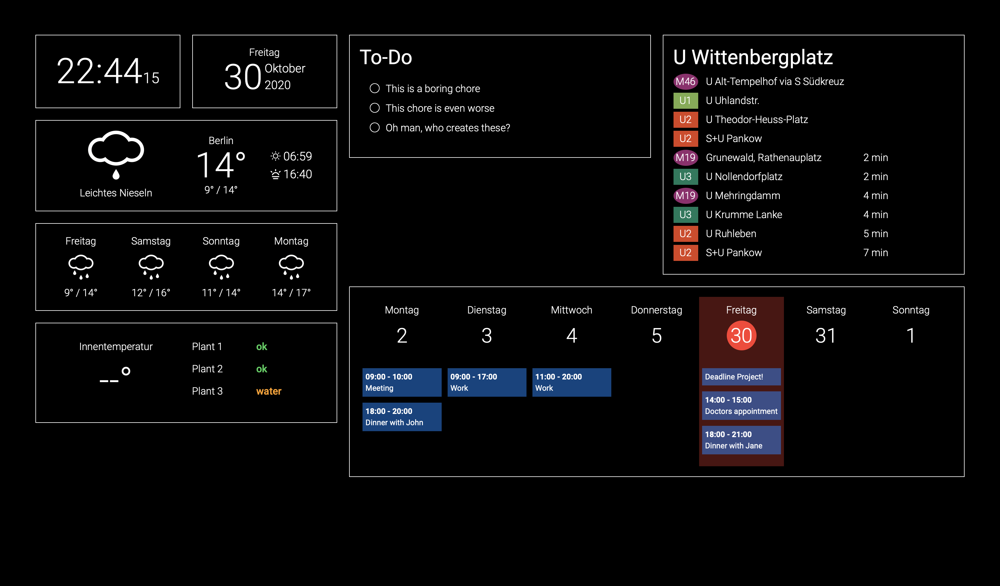

# smartMirror
This application was created for a smart mirror project. It displays the time, date, current weather, room temperature, an Apple calendar and current information about the public transport in Berlin, Germany. 

As soon as I finish building the sensor, it will also display the current well being of my house plants.

